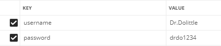
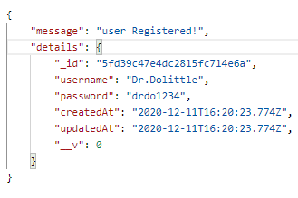
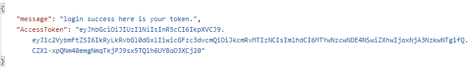
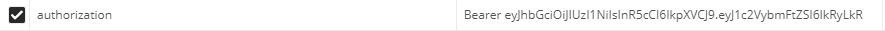
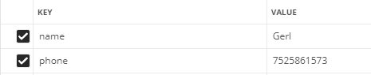
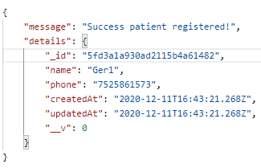
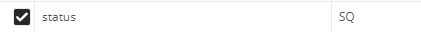
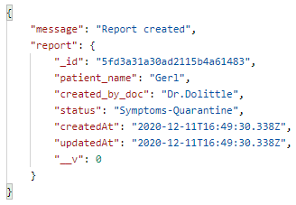
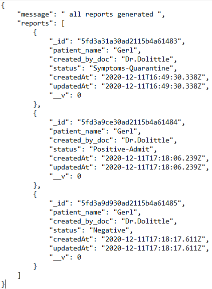
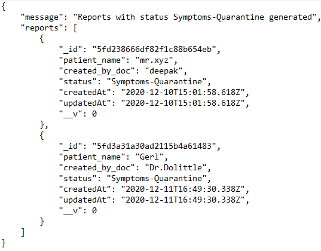

# HospitalAPI

A basic API to keep track of patients' covid status and generate reports for them. 

## Features

* Register Doctor with username and password.
* User login and returns jwt token to access protected routes.
* Patient Registration(jwt protected) : A doctor can register a patient with name and phone no.
* Report Generation(jwt protected) : A doctor can generate report providing patient status.
* View all reports (jwt protected) : A doctor can view all reports of a particular patient.
* Reports filtered by status (jwt protected): A doctor can view all reports present in database filtered by status.

## How to install and run?

1. Clone this project
2. Install all dependencies by `npm install`
3. Config MongoDB by adding your db connect url in `HospitalAPI/config/mongoose.js`
4. `npm start`

## How to use the API?

#### Base URL : `http://localhost:3000/api/v1`

#### API End points :

1. `/doctors/register`(POST): Register Doctor with username and password. 
Example input: 
 
Example output: 
 

2. `/doctors/login`(POST): login Doctor with your username and password. 
Example input: 
 
Example output:(Recieve jwt token in response) 
 
> All further requests will include JWT token in Authorization header. 
 

3. `/patients/register`(POST): Register Patient with his name and phone no. 
Example input: 
 
Example output: 
 

4. `/patients/:phone/create_report`(POST): create patient report using phone no and status. Here patient phone no is being treated as patient ID. 
Example input: 
NOTE: Status N,TQ,SQ,PA are mapped to Negative, Travelled-Quarantine, Symptoms-Quarantine, Positive-Admit. 
 
Example output: 
 

5. `/patients/:phone/all_reports`(GET): Generate all reports of a patient by ID (phone number) sent in params. 
Example output : 
 
6. `/reports/:status`(GEt): Generate  all the reports of all the patients filtered by a specific status. 
NOTE: Status N,TQ,SQ,PA are mapped to Negative, Travelled-Quarantine, Symptoms-Quarantine, Positive-Admit. 
Example output : 
 

## Directory Structure

This project follows MVC Structure. 
`assets` Contains Static files. 
`config` Contains config files for js libries used in project. 
`controllers` Contains functions for controlling the api endpoints. 
`models` Contains different database models. 
`routes` Contains all routes.
        
